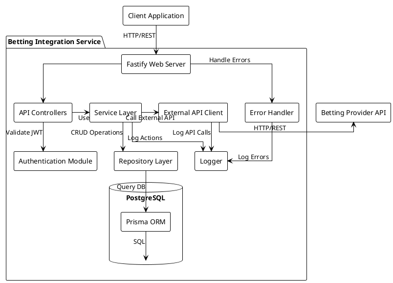
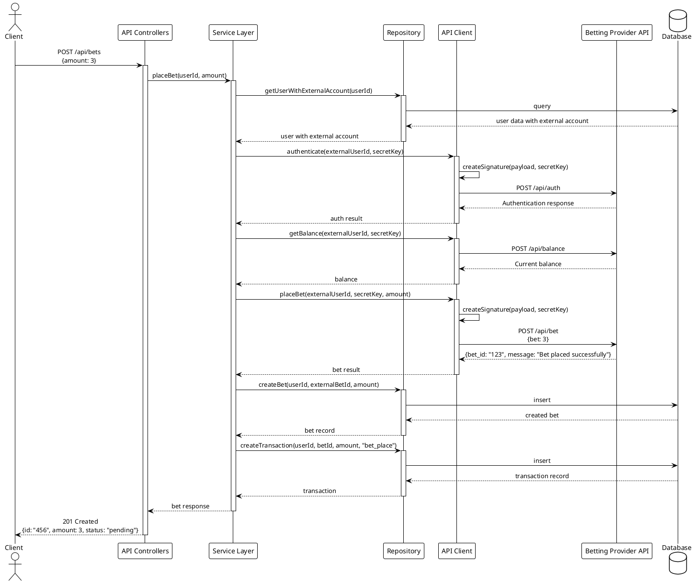
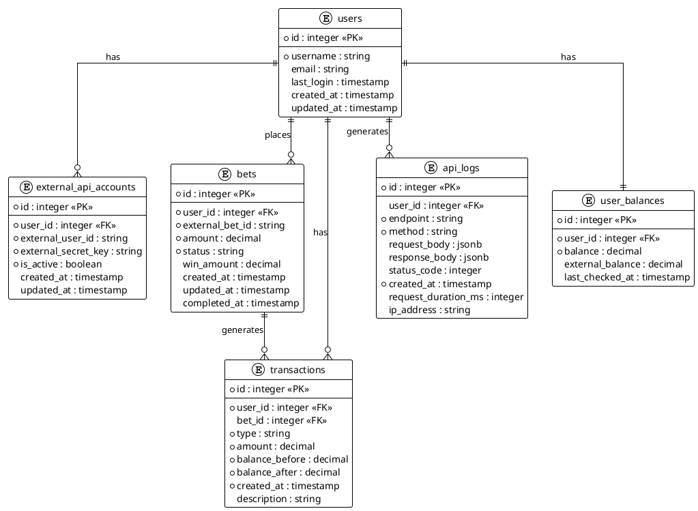

# Тестовое задание: Разработка сервиса интеграции с API платформы ставок

## Введение

Необходимо разработать бэкенд-сервис, который будет интегрироваться с API платформы ставок, доступным по адресу `https://bets.tgapps.cloud/api`. Сервис должен предоставлять расширенную функциональность, надежное хранение данных и удобный интерфейс для клиентских приложений.

## Описание задачи

Ваш сервис должен выступать промежуточным слоем между клиентскими приложениями и API платформы ставок. Вам предстоит реализовать полный цикл взаимодействия с API ставок, начиная от аутентификации пользователя и заканчивая обработкой результатов ставок.

## Технические требования

### Стек технологий

- **Фреймворк**: Express
- **Язык**: TypeScript
- **База данных**: PostgreSQL
- **ORM**: Prisma
- **Пакетный менеджер**: pnpm
- **Тестирование**: Jest
- **Контейнеризация**: Docker и Docker Compose


## Диаграммы 

### Компонентная диаграмма системы




### Последовательная диаграмма размещения ставки


### Диаграмма базы данных 


Предложенные варианты являются ориентировочными, не обязательно им следовать досконально. 

## Обязательные к реализации эндпоинты

### Эндпоинты для пользователей:

#### 1. Аутентификация

**POST /api/auth/login**
- Описание: Аутентификация пользователя, получение JWT-токена
- Запрос:
  ```json
  {
    "username": "user1"
  }
  ```
- Ответ (200 OK):
  ```json
  {
    "token": "eyJhbGciOiJIUzI...",
    "expiresIn": 3600
  }
  ```
- Ответ (404 Not Found):
  ```json
  {
    "statusCode": 404,
    "error": "Not Found",
    "message": "User not found"
  }
  ```

#### 2. Управление ставками

**GET /api/bets**
- Описание: Получение истории ставок пользователя
- Заголовки: `Authorization: Bearer {token}`
- Ответ (200 OK):
  ```json
  {
    "bets": [
      {
        "id": "123",
        "amount": 3,
        "status": "completed",
        "win_amount": 6,
        "created_at": "2023-06-15T10:30:00Z",
        "completed_at": "2023-06-15T10:31:00Z"
      },
      {
        "id": "124",
        "amount": 2,
        "status": "pending",
        "created_at": "2023-06-15T11:30:00Z"
      }
    ]
  }
  ```

**GET /api/bets/:id**
- Описание: Получение информации о конкретной ставке
- Заголовки: `Authorization: Bearer {token}`
- Ответ (200 OK):
  ```json
  {
    "id": "123",
    "amount": 3,
    "status": "completed",
    "win_amount": 6,
    "created_at": "2023-06-15T10:30:00Z",
    "completed_at": "2023-06-15T10:31:00Z"
  }
  ```
- Ответ (404 Not Found):
  ```json
  {
    "statusCode": 404,
    "error": "Not Found",
    "message": "Bet not found"
  }
  ```

**POST /api/bets**
- Описание: Размещение новой ставки
- Заголовки: `Authorization: Bearer {token}`
- Запрос:
  ```json
  {
    "amount": 3
  }
  ```
- Ответ (201 Created):
  ```json
  {
    "id": "125",
    "amount": 3,
    "status": "pending",
    "created_at": "2023-06-15T12:30:00Z"
  }
  ```
- Ответ (400 Bad Request):
  ```json
  {
    "statusCode": 400,
    "error": "Bad Request",
    "message": "Invalid bet amount. Must be between 1 and 5."
  }
  ```

**GET /api/bets/recommended**
- Описание: Получение рекомендуемой ставки
- Заголовки: `Authorization: Bearer {token}`
- Ответ (200 OK):
  ```json
  {
    "recommended_amount": 3
  }
  ```

#### 3. Управление балансом

**GET /api/balance**
- Описание: Получение текущего баланса пользователя
- Заголовки: `Authorization: Bearer {token}`
- Ответ (200 OK):
  ```json
  {
    "balance": 1150,
    "last_updated": "2023-06-15T12:30:00Z"
  }
  ```

**GET /api/transactions**
- Описание: Получение истории транзакций
- Заголовки: `Authorization: Bearer {token}`
- Параметры: `?page=1&limit=10` (опционально)
- Ответ (200 OK):
  ```json
  {
    "transactions": [
      {
        "id": "789",
        "type": "bet_win",
        "amount": 6,
        "balance_before": 1000,
        "balance_after": 1006,
        "description": "Win amount for bet #123",
        "created_at": "2023-06-15T10:31:00Z"
      },
      {
        "id": "790",
        "type": "bet_place",
        "amount": -3,
        "balance_before": 1006,
        "balance_after": 1003,
        "description": "Bet placement #124",
        "created_at": "2023-06-15T11:30:00Z"
      }
    ],
    "pagination": {
      "total": 15,
      "page": 1,
      "limit": 10,
      "pages": 2
    }
  }
  ```

#### 4. Дополнительные эндпоинты

**GET /api/health**
- Описание: Проверка работоспособности сервиса
- Ответ (200 OK):
  ```json
  {
    "status": "ok",
    "timestamp": "2023-06-15T12:00:00Z",
    "services": {
      "api": "ok",
      "database": "ok",
      "external_api": "ok"
    }
  }
  ```

### Внутренние эндпоинты для тестирования:

Эти эндпоинты должны быть защищены и доступны только для тестирования интеграции с API ставок.

**POST /api/internal/auth**
- Описание: Тестирование аутентификации в API ставок
- Заголовки: `Authorization: Bearer {admin_token}`
- Запрос:
  ```json
  {
    "user_id": "5"
  }
  ```
- Ответ (200 OK):
  ```json
  {
    "success": true,
    "external_response": {
      "message": "Successfully authenticated",
      "user_id": "5",
      "username": "user5"
    }
  }
  ```

**GET /api/internal/bet**
- Описание: Тестирование получения рекомендуемой ставки от API
- Заголовки: `Authorization: Bearer {admin_token}`
- Запрос:
  ```json
  {
    "user_id": "5"
  }
  ```
- Ответ (200 OK):
  ```json
  {
    "success": true,
    "external_response": {
      "bet": 3
    }
  }
  ```

**POST /api/internal/bet**
- Описание: Тестирование размещения ставки в API
- Заголовки: `Authorization: Bearer {admin_token}`
- Запрос:
  ```json
  {
    "user_id": "5",
    "bet": 3
  }
  ```
- Ответ (200 OK):
  ```json
  {
    "success": true,
    "external_response": {
      "message": "Bet placed successfully",
      "bet_id": "456"
    }
  }
  ```

**POST /api/internal/win**
- Описание: Тестирование получения результата ставки от API
- Заголовки: `Authorization: Bearer {admin_token}`
- Запрос:
  ```json
  {
    "user_id": "5",
    "bet_id": "456"
  }
  ```
- Ответ (200 OK):
  ```json
  {
    "success": true,
    "external_response": {
      "win": 6,
      "message": "Congratulations! You won!"
    }
  }
  ```

**POST /api/internal/balance**
- Описание: Тестирование установки/получения баланса от API
- Заголовки: `Authorization: Bearer {admin_token}`
- Запрос (для установки баланса):
  ```json
  {
    "user_id": "5",
    "balance": 1000
  }
  ```
- Запрос (для получения баланса):
  ```json
  {
    "user_id": "5"
  }
  ```
- Ответ (200 OK, установка баланса):
  ```json
  {
    "success": true,
    "external_response": {
      "message": "Balance set successfully",
      "balance": 1000
    }
  }
  ```
- Ответ (200 OK, получение баланса):
  ```json
  {
    "success": true,
    "external_response": {
      "balance": 1006
    }
  }
  ```

**POST /api/internal/check-balance**
- Описание: Тестирование проверки баланса в API
- Заголовки: `Authorization: Bearer {admin_token}`
- Запрос:
  ```json
  {
    "user_id": "5",
    "expected_balance": 1006
  }
  ```
- Ответ (200 OK, верный баланс):
  ```json
  {
    "success": true,
    "external_response": {
      "is_correct": true,
      "balance": 1006
    }
  }
  ```
- Ответ (200 OK, неверный баланс):
  ```json
  {
    "success": true,
    "external_response": {
      "is_correct": false,
      "message": "Incorrect balance. Expected: 1010, Actual: 1006",
      "correct_balance": 1006
    }
  }
  ```

## Детальное описание потока взаимодействия с API

Документация API доступна по адресу: `https://bets.tgapps.cloud/api/docs/` (Swagger UI)

API платформы ставок требует определенной последовательности запросов. Ваш сервис должен корректно реализовать следующий поток взаимодействия:

### 1. Аутентификация

- Каждый запрос к API должен включать заголовки:
  - `user-id`: ID пользователя в системе (вам будет предоставлен индивидуальный ID)
  - `x-signature`: HMAC SHA-512 подпись тела запроса, сгенерированная с использованием секретного ключа (также будет предоставлен)

- Первый шаг — аутентификация пользователя через `POST /api/auth`
  - Запрос должен содержать корректные заголовки, тело запроса может быть пустым объектом
  - Успешный ответ подтверждает, что пользователь аутентифицирован в системе

### 2. Управление балансом

- После аутентификации необходимо установить начальный баланс через `POST /api/balance`
  - В теле запроса должен быть указан начальный баланс: `{ "balance": 1000 }`
  - Баланс устанавливается только один раз, последующие запросы без тела будут возвращать текущий баланс

### 3. Получение и размещение ставки

- Для получения рекомендуемой ставки используется `GET /api/bet`
  - Возвращает случайную ставку в диапазоне от 1 до 5

- Размещение ставки происходит через `POST /api/bet`
  - В теле запроса должна быть указана сумма ставки: `{ "bet": 3 }`
  - Ставка должна быть в пределах от 1 до 5
  - В ответе вернется идентификатор размещенной ставки (`bet_id`)

### 4. Обработка результата ставки

- Для получения результата ставки используется `POST /api/win`
  - В теле запроса должен быть указан идентификатор ставки: `{ "bet_id": "123" }`
  - В ответе будет информация о выигрыше или проигрыше
  - В случае выигрыша баланс увеличивается, в случае проигрыша — уменьшается

### 5. Проверка баланса

- После обработки результата ставки рекомендуется получить обновленный баланс через `POST /api/balance` (без тела запроса)

- Дополнительно можно проверить корректность баланса через `POST /api/check-balance`
  - В теле запроса указывается ожидаемый баланс: `{ "expected_balance": 1050 }`
  - API сравнит ожидаемый баланс с фактическим и вернет результат проверки

## Пример реализации HMAC SHA-512 подписи

```typescript
// Функция для создания подписи HMAC SHA-512
import crypto from 'crypto';

function createSignature(body: Record<string, any> | null, secretKey: string): string {
  // Преобразуем тело запроса в JSON строку
  const payload = JSON.stringify(body || {});
  
  // Создаем HMAC с использованием алгоритма SHA-512 и секретного ключа
  const hmac = crypto.createHmac('sha512', secretKey);
  
  // Обновляем HMAC с данными тела запроса
  hmac.update(payload);
  
  // Возвращаем подпись в шестнадцатеричном формате
  return hmac.digest('hex');
}

// Пример использования
const requestBody = { balance: 1000 };
const secretKey = 'your-secret-key-here';
const signature = createSignature(requestBody, secretKey);

// Использование в заголовках запроса
const headers = {
  'user-id': 'your-user-id',
  'x-signature': signature,
  'Content-Type': 'application/json'
};
```

## Функциональные требования

Ваш сервис должен реализовать следующие функции:

### 1. Управление пользователями

- Создание пользователей через миграции или сидирование базы данных
- Связывание пользователей вашей системы с пользователями API ставок
- JWT-аутентификация для защиты ваших API-эндпоинтов

### 2. Интеграция с API ставок

- Корректная реализация всех шагов взаимодействия с API
- Надежная обработка HMAC SHA-512 подписи для всех запросов
- Механизмы повторных попыток при сбоях во внешнем API
- Обработка всех возможных ошибок и граничных случаев

### 3. Операции со ставками

- Получение рекомендуемых ставок
- Размещение ставок с валидацией
- Обработка результатов ставок
- Ведение истории ставок пользователя

### 4. Управление балансом

- Отслеживание и синхронизация баланса пользователя
- Ведение истории транзакций
- Проверка соответствия ожидаемого и фактического баланса

## Требования к базе данных

Спроектируйте схему базы данных с использованием Prisma ORM, которая должна содержать как минимум следующие сущности:

- **Пользователи** — информация о пользователях вашей системы
- **Внешние учетные записи** — данные для интеграции с API ставок (ID пользователя, секретный ключ)
- **Ставки** — информация о размещенных ставках и их результатах
- **Транзакции** — история изменений баланса
- **Логи API** — записи о взаимодействии с внешним API

Необходимо создать корректные миграции Prisma, которые должны:
- Создавать все необходимые таблицы
- Определять связи между сущностями
- Создавать необходимые индексы для оптимизации запросов
- Включать начальные данные (seeding) для пользователей и внешних учетных записей

## Требования к безопасности

- Безопасное хранение секретных ключей пользователей
- Защита API с использованием JWT-токенов
- Валидация всех входящих данных
- Логирование подозрительной активности

## Дополнительные требования

- Реализуйте механизмы повторных попыток для нестабильных вызовов API
- Разработайте систему логирования для отслеживания всех взаимодействий
- Обеспечьте идемпотентность операций, где это необходимо
- Реализуйте механизмы для обнаружения и разрешения конфликтов данных

## Требования к документации и тестированию

- Реализуйте покрытие кода unit-тестами (минимум 70%)
- Предоставьте документацию по API (Swagger/OpenAPI)
- Включите инструкции по развертыванию и использованию
- Опишите архитектуру вашего решения

## Критерии оценки (максимум 100 баллов)

### 1. Архитектура и структура кода (25 баллов)
- Чистая и поддерживаемая архитектура (10 баллов)
- Правильное разделение ответственности (8 баллов)
- Следование принципам SOLID (7 баллов)

### 2. Функциональность (30 баллов)
- Корректная реализация взаимодействия с API ставок (10 баллов)
- Правильная обработка пограничных случаев (10 баллов)
- Механизмы повторных попыток и обработка ошибок (10 баллов)

### 3. Работа с базой данных (15 баллов)
- Корректная схема данных и связи (5 баллов)
- Правильная реализация миграций и сидирования (5 баллов)
- Эффективные запросы и использование индексов (5 баллов)

### 4. Качество кода (15 баллов)
- Чистый, читаемый код с комментариями (5 баллов)
- Корректное использование TypeScript (типы, интерфейсы) (5 баллов)
- Адекватное логирование и структурированная обработка ошибок (5 баллов)

### 5. Тестирование и документация (15 баллов)
- Покрытие кода тестами (минимум 70%) (8 баллов)
- Качество и полнота документации (7 баллов)

## Бонусные баллы (максимум 10 баллов)

- Реализация ограничения частоты запросов (rate limiting) (5 балла)
- Реализация простой админ-панели для просмотра данных (5 балла)


## Сроки и формат сдачи

- Срок выполнения: 1-2-3 дня
- Результат необходимо предоставить в виде ссылки на Git-репозиторий
- Репозиторий должен содержать:
  - Исходный код решения
  - Docker Compose конфигурацию
  - README с инструкциями по запуску и использованию
  - Документацию по API

## Важные замечания

- Для тестирования вам будет предоставлен уникальный ID пользователя и секретный ключ для формирования подписи
- Обратите особое внимание на обработку ошибок и граничных случаев при взаимодействии с API
- Учтите возможную нестабильность внешнего API и реализуйте соответствующие механизмы защиты
- Продумайте стратегию синхронизации баланса между вашей системой и внешним API

Желаем успехов в выполнении задания!